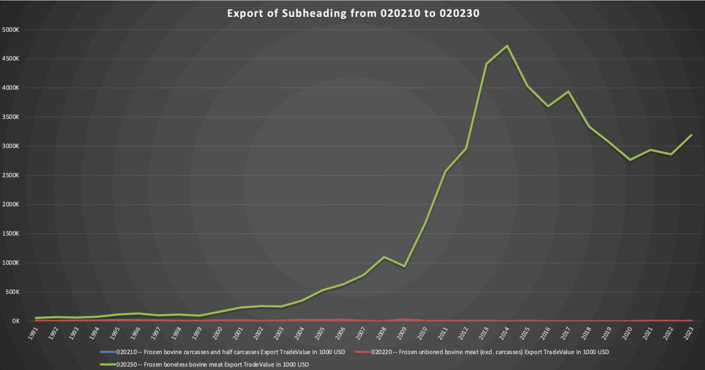
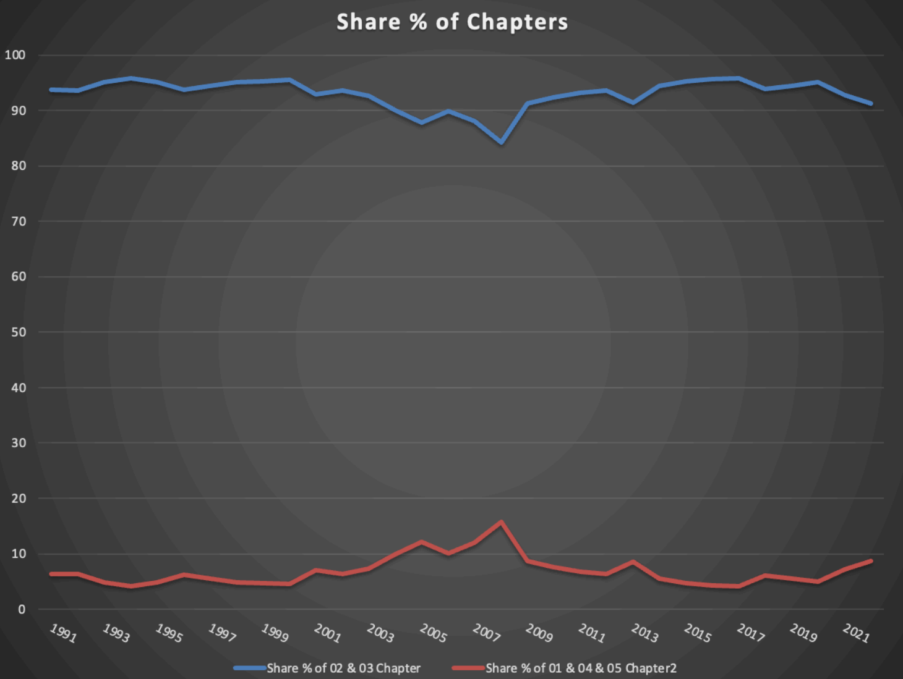
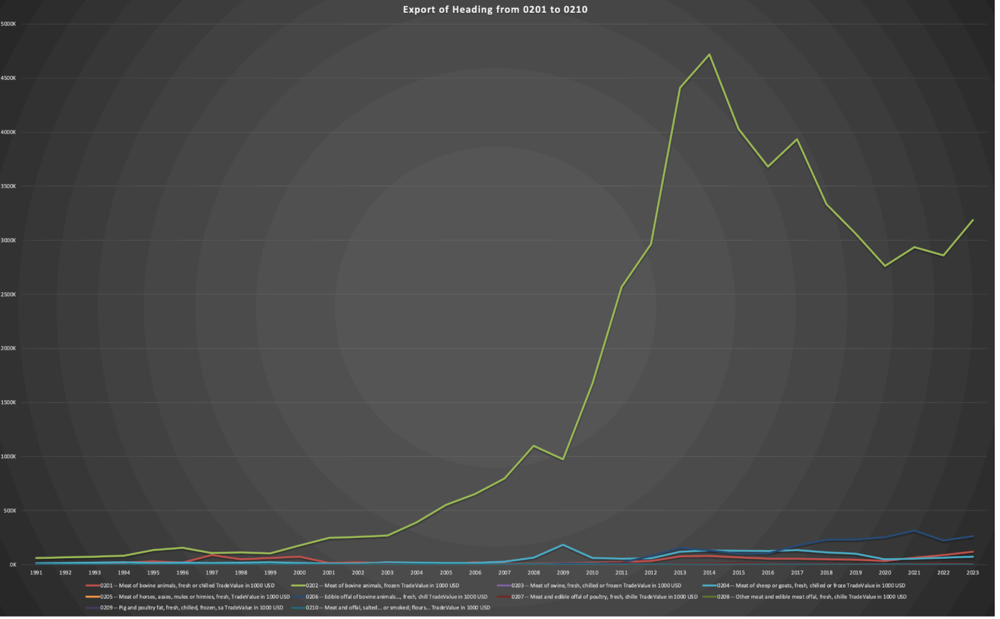
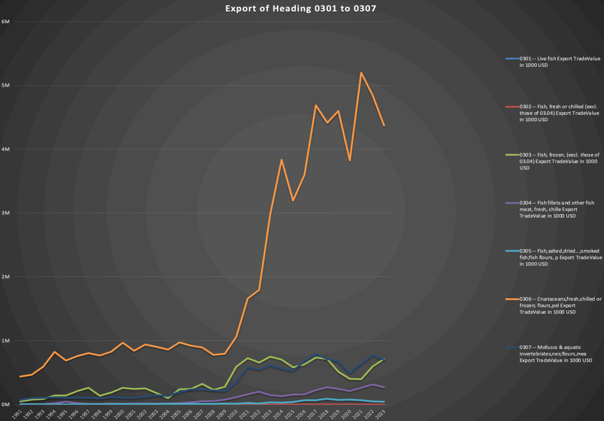
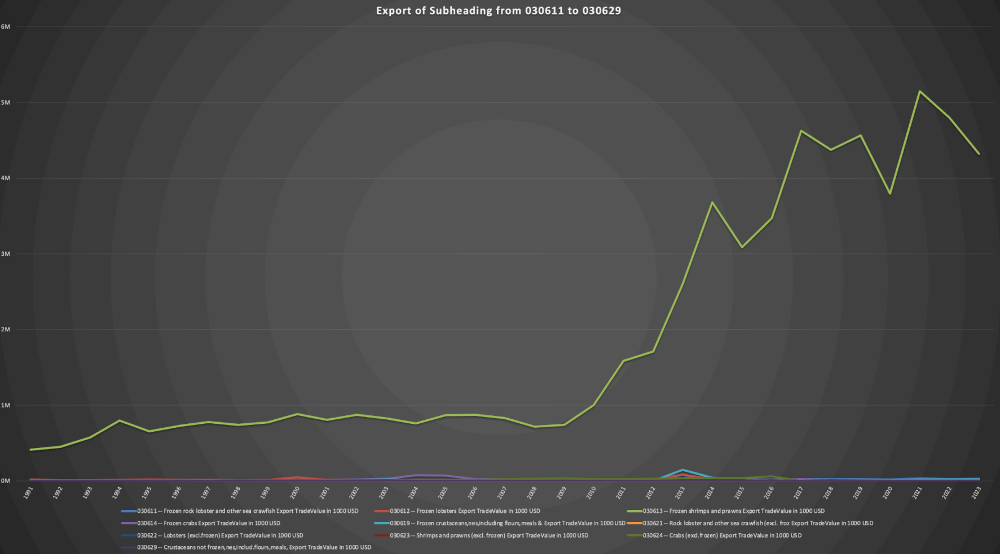

# Animal-Trade-Analysis-WITS
_A data visualization and trend analysis of India's animal product exports using WITS dataset (1991–2023)_

Trade flow analysis of India’s animal product exports (HS 01–05) using WITS data from 1991–2023.

# Animal Trade Analysis (HS 01–05) – India (1991–2023)

This project presents a trade flow analysis of India's animal product exports from 1991 to 2023, using data from the World Integrated Trade Solution (WITS) platform. The focus is on HS Chapters 01 to 05, with deep dives into dominant export subheadings.

---

## 📊 Key Findings

- India's animal product trade is **export-dominant**, especially after 2009.
- **Chapters 02 (Meat)** and **03 (Fish & Crustaceans)** contribute over **94%** of exports in this sector.
- **Subheadings 020230 (Frozen boneless bovine meat)** and **030613 (Frozen shrimps & prawns)** alone account for **66%** of total exports in the category.
- Visual analysis and charts created in Excel, based on WITS data.

---

## 📂 Contents

- [`Animal_Products_Trade_Report_Final.pdf`](Animal_Products_Trade_Report_Final.pdf) – Complete project report  
- `/graphs/` folder – All data visualizations used in this project

---

## 🖼️ Visual Graphs from the Analysis

### Export Trend Over Time (1991–2023)
Shows how export values in the animal product sector spiked post-2002, peaking after 2009.

---

### Chapter-Wise Export Dominance
Chapter 02 (Meat) and Chapter 03 (Fish & Crustaceans) contribute over 94% of exports.

---

### Heading-Level Breakdown – Chapter 02
Export surge in Heading 0202: Frozen Meat of Bovine Animals.

---

### Heading-Level Breakdown – Chapter 03
Heading 0306: Crustaceans dominate post-2009.

---

### Subheading Spotlight: 020230
Frozen boneless bovine meat is the key driver in Chapter 02 exports.

---

### Subheading Spotlight: 030613
Frozen shrimps and prawns showed explosive growth post-2009.

---

## 📚 Tools Used

- WITS (World Integrated Trade Solution)
- Microsoft Excel
- Data classification based on HS Code (01–05)

---

## 👨‍💻 Author

**Farhanur Rahman**  
BA (Hons) Economics, Rishihood University  
GitHub: [far-rahman](https://github.com/far-rahman)  
LinkedIn: [farhanur-rahman9955](https://linkedin.com/in/farhanur-rahman9955)

---

**Disclaimer:** This is an independent academic project. Data accuracy is based on public WITS datasets and is interpreted solely for educational purposes.

